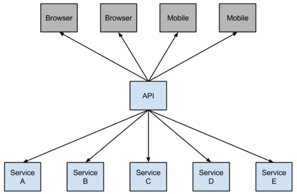
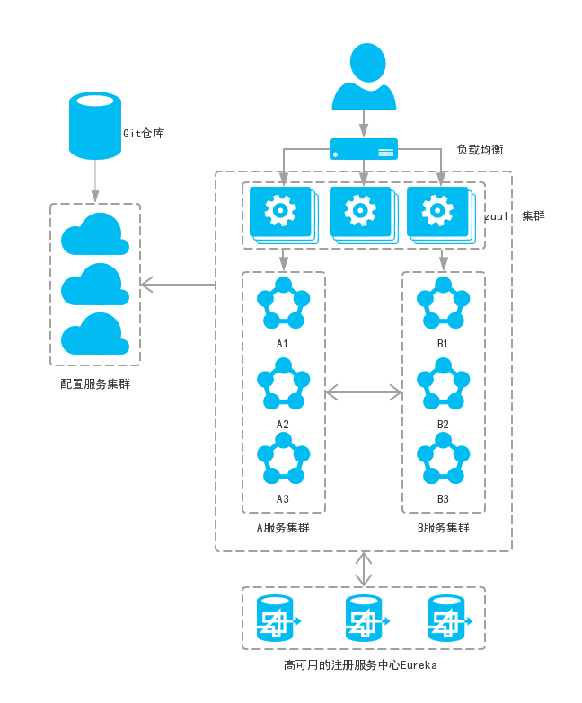
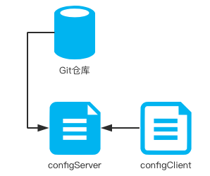
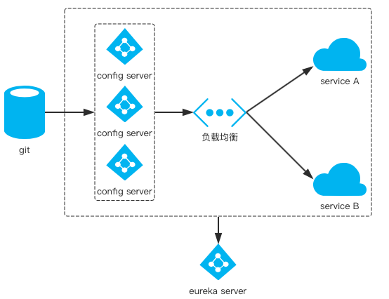
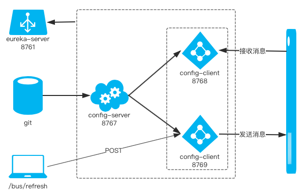

# spring-cloud
 * Understand Spring Cloud and microservices build
 
## -- contents --
 
#### Recommended order：
 
### spring-cloud-pre module
 * The preparation for Spring Cloud
 * 1.For Spring Boot, the configuration file application.properties and application.yml are chosen one by one.
 * 2.In the traditional SpringMVC architecture, we generally put JSP and HTML pages under the webapps directory, 
 but Spring Boot does not have webapps, and there is no web.xml. If we want to write the interface, what should we do?   
 &nbsp;&nbsp; Spring Boot officially provides several template engines: FreeMarker, Velocity, Thymeleaf, Groovy, mustache, JSP.  
 &nbsp;&nbsp; Create two directories under resources: static and templates   
 &nbsp;&nbsp; The static directory is used to store static resources, such as CSS, JS, HTML, etc. 
 The templates directory stores the template engine files. We can create a file under templates: index.ftl 
 (freemarker default suffix is .ftl)
 
### eureka-server module
### eureka-client module
 * Service registration and discovery (Eureka) (Finchley version)
 * Spring cloud provides developers with tools to quickly build distributed systems, 
 including configuration management, service discovery, circuit breakers, routing, micro-proxies, event buses, global locks, 
 decision-making campaigns, distributed sessions, and more. It runs in a simple environment and can run on the developer's computer.
 
### service-ribbon module
 * In the microservices architecture, the business is split into a separate service, and the communication between the 
 service and the service is based on http restful. Spring cloud has two service invocation methods, 
 one is ribbon+restTemplate and the other is feign. This module is based on ribbon+rest.
 * Ribbon is a load balancing client that can control some behaviors of htt and tcp. Feign integrates ribbon by default.
 * The ribbon has implemented these configuration beans by default:
   * IClientConfig ribbonClientConfig: DefaultClientConfigImpl
   * IRule ribbonRule: ZoneAvoidanceRule
   * IPing ribbonPing: NoOpPing
   * ServerList ribbonServerList: ConfigurationBasedServerList
   * ServerListFilter ribbonServerListFilter: ZonePreferenceServerListFilter
   * ILoadBalancer ribbonLoadBalancer: ZoneAwareLoadBalancer  
 * Steps：  
   * Start EurekaServerApplication
   * Start EurekaClient01Application
   * Modify eureka-client's port from 8762 to 8763 in application.yml 
   * Start EurekaClient02Application
   * Start ServiceRibbonApplication
   * Visit http://localhost:8764/hi?name=eureka multiple times on the browser, and the browser alternates:  
     Hi eureka,i am from port:8762  
     Hi eureka,i am from port:8763  
 * Architecture：  
   
  * A service registry, eureka server, port is 8761
  * The service-hi project ran two instances, the ports are 8762, 8763, respectively registered with the service registry
  * The service-ribbon port is 8764, registered with the service registry
  * When service-ribbon calls service-hi's hi interface through restTemplate, because load balancing is performed with 
  ribbon, service-hi:8762 and 8763 two ports' hi interfaces are called in turn.
  
### service-feign module
  * Feign is a declarative pseudo-Http client that makes writing Http clients easier. With Feign, you only need to 
  create an interface and annotate it. It has pluggable annotation features and can use Feign annotations and JAX-RS 
  annotations. Feign supports pluggable encoders and decoders. Feign integrates Ribbon by default and combines with 
  Eureka to achieve load balancing by default.  
  * in short:  
    * Feign uses interface-based annotations
    * Feign integrates ribbon  
  * Steps：  
    * Start EurekaServerApplication
    * Start EurekaClient01Application
    * Modify eureka-client's port from 8762 to 8763 in application.yml 
    * Start EurekaClient02Application
    * Start ServiceFeignApplication
    * Visit http://localhost:8765/hi?name=eureka multiple times on the browser, and the browser alternates:  
      Hi eureka,i am from port:8762  
      Hi eureka,i am from port:8763 
      
### Hystrix（断路器）
 * In the micro-service architecture, services are split into services according to the service. The services and services 
 can be called by each other (RPC). In SpringCloud, they can be called with RestTemplate+Ribbon and Feign. To ensure 
 high availability, a single service is usually clustered. For network reasons or for its own reasons, the service is 
 not guaranteed to be 100% available. If there is a problem with a single service, the thread will be blocked when the 
 service is invoked. If a large number of requests flood in, the thread resources of the Servlet container will be consumed, 
 causing service paralysis. The dependency between service and service, the failure will spread, will have catastrophic 
 serious consequences for the entire micro-service system, which is the "avalanche" effect of service failure.  
 In order to solve this problem, the industry has proposed a circuit breaker model.
 * Hystrix: Netflix has created a library called Hystrix that implements the circuit breaker pattern. In a microservice 
 architecture it is common to have multiple layers of service calls.
 * Netflix has open sourced the Hystrix component and implemented the circuit breaker mode, which SpringCloud has integrated. 
 In the microservices architecture, it is very common for a request to call multiple services, as shown below:  
   
 * A lower-level service can cause a cascading failure if it fails. When the call to a particular service is unavailable, 
 a threshold is reached (Hystric is 5 seconds 20 times) and the circuit breaker will be opened. 
   
 * After the open circuit is opened, it can be used to avoid cascading failures. The fallback method can directly return a fixed value. 
 * Steps:
   * Start EurekaServerApplication
   * Start EurekaClient01Application
   * Start ServiceRibbonApplication
   * Start ServiceFeignApplication
   * Visit http://localhost:8764/hi?name=eureka. The web page displays: Hi eureka,i am from port:8762
   * Visit http://localhost:8765/hi?name=eureka. The web page displays: Hi eureka,i am from port:8762   
   * Stop EurekaClient01Application
   * Visit http://localhost:8764/hi?name=eureka. The web page displays: hi, eureka, Sorry, there has occurred an error!
   * Visit http://localhost:8765/hi?name=eureka. The web page displays: hi, eureka, Sorry, there has occurred an error!   
   This proves that the circuit breaker is working.  
   * Visit http://localhost:8764/hystrix. The web page displays Hystrix Dashboard.

### service-zuul module
 * Routing gateway(路由网关)  
 In the micro-service architecture, several basic service governance components are needed, including service 
 registration and discovery, service consumption, load balancing, circuit breakers, intelligent routing, configuration 
 management, etc., and these basic components work together to form a common Simple microservice system. 
 A simple microservice system is shown below:      
    
 In the Spring Cloud microservice system, a common load balancing method is that the client's request is first 
 load-balanced (zuul, Nginx), then to the service gateway (zuul cluster), and then to the specific service. The service 
 is uniformly registered to the highly available service registry cluster. All configuration files of the service are 
 managed by the configuration service, and the configuration file of the configuration service is placed in the git 
 repository, so that the developer can change the configuration at any time.  
 * Introduction to Zuul  
 The main functions of Zuul are route forwarding and filters. The routing function is part of the microservice, such as 
 /api/user forwarded to the user service, /api/shop forwarded to the shop service. 
 Zuul combines with Ribbon to implement load balancing.
 * Zuul has the following features:
   * Authentication
   * Insights
   * Stress Testing
   * Canary Testing
   * Dynamic Routing
   * Service Migration
   * Load Shedding
   * Security
   * Static Response handling
   * Active/Active traffic management
 * Steps:
    * Start EurekaServerApplication
    * Start EurekaClient01Application
    * Start ServiceRibbonApplication
    * Start ServiceFeignApplication
    * Start ZuulApplication
    * Visit http://localhost:8766/api-a/hi?name=eureka. The web page displays: token is empty
    * Visit http://localhost:8766/api-a/hi?name=eurekaA&token=12. The web page displays: Hi eurekaA,i am from port:8762 
    * Visit http://localhost:8766/api-b/hi?name=eurekaB&token=21. The web page displays: Hi eurekaB,i am from port:8762  
    This shows that zuul plays the role of routing: Requests starting with /api-a/ are forwarded to the service-ribbon 
    service; requests beginning with /api-b/ are forwarded to the service-feign service.
    
### config-server module
### config-client module
 * In a distributed system, due to the large number of services, in order to facilitate unified management of service 
 configuration files and real-time updates, a distributed configuration center component is required. In Spring Cloud, 
 there is a distributed configuration hub component spring cloud config that supports configuration services in the 
 memory of the configuration service (ie local) and also in remote Git repositories. In the spring cloud config 
 component, there are two roles, one is config server and the other is config client.
 * config-client-dev.properties see 
 [Configuration link](https://github.com/nengqiang/spring-cloud-config/blob/master/config/config-client-dev.properties)
 * Note that the configuration file name of spring cloud config client is bootstrap.properties 
 instead of application.properties
 * Steps:
   * Start ConfigServerApplication
   * Visit http://localhost:8767/config-client/dev. The web page displays:   
   {"name":"config-client","profiles":["dev"],"label":"master","version":"e46301faa736e7dbeac6f095d122147f36a13eb3",
   "state":null,"propertySources":
   [{"name":"https://github.com/nengqiang/spring-cloud-config/config/config-client-dev.properties",
   "source":{"configclient.message":"I'm in github's repository","turkey":"turkey version 1"}}]}  
   This proves that the remote program can get configuration information from the configuration service center.  
   The http request address and resource file mapping are as follows:
     * /{application}/{profile}[/{label}]
     * /{application}-{profile}.yml
     * /{label}/{application}-{profile}.yml
     * /{application}-{profile}.properties
     * /{label}/{application}-{profile}.properties
   * Start ConfigClientApplication
   * Visit http://localhost:8768/hi. The web page displays: turkey version 1  
   This shows that config-client gets the turkey property from config-server, and config-server is read from 
   the git repository, as shown in Figure:  
   
 
### Highly available distributed configuration center
 * A service can read files from the configuration center. The configuration center can read configuration files from 
 remote git. When there are many service instances, the files are read from the configuration center. In this case, 
 consider configuring the configuration center as a micro service. Clustered to achieve high availability, 
 the architecture diagram is as follows:  
   
 * Steps:
   * Start EurekaServerApplication
   * Start ConfigServerApplication
   * Start ConfigClient01Application
   * Visit http://localhost:8761/ we can see both config-server and config-client are already registered to the 
   service center.
   * Visit http://localhost:8768/hi. The web page displays: turkey version 1

### Spring Cloud Bus 
 * Spring Cloud Bus connects distributed nodes with lightweight message brokers. It can be used for broadcast profile 
 changes or for communication between services, as well as for monitoring.
 * Plus start-up depends on spring-cloud-starter-bus-amqp to config-client module
 * Integrates rabbitmq
 * Attention:
   * spring.rabbitmq.port=5672 instead of 15672
   * Add management.security.enabled=false to application.properties to prevent requests(POST) from refresh to report 
   permission issues
   * The class that injects the parameter should be annotated with @RefreshScope. Note that this annotation does not 
   have to be added to the class where the main method is located, but to the class that has the parameters injected 
   from configServer.
 * Steps:
   * Start EurekaServerApplication
   * Start ConfigServerApplication
   * Start ConfigClient01Application
   * Modify the server port of config-client to 8769
   * Start ConfigClient02Application
   * Visit http://localhost:8768/hi. The web page displays: turkey version 1
   * Visit http://localhost:8769/hi. The web page displays: turkey version 1
   * Modify the config-client-dev.properties, upgrade the turkey version
   * Use PostMan to send POST request: http://localhost:8768/bus/refresh
   * Visit http://localhost:8768/hi. The web page displays: turkey version 2.1(Modified version)
   * Visit http://localhost:8769/hi. The web page displays: turkey version 2.1(Modified version)  
   It means The entire microservice cluster has reached the goal of updating the configuration file, and we don't have
   to restart the application.  
   the architecture diagram is as follows:  
     
 
### server-zipkin module
### service-hi module
### service-hello module
 * Service tracking component zipkin
 * On the micro-service architecture, services are used to divide services. Through an REST call, an external interface 
 may require a large number of service collaborations to complete the interface function. If any service on the link has 
 a problem or the network times out, the interface will be formed. The call failed. As the business continues to expand, 
 calls between services become more complex.  
 As more services become available, the analysis of the call chain becomes more complex.
 * Note: Every service's controller(not server's) should contains Bean of AlwaysSampler, otherwise it will not be tracked.
 * Steps:
   * Start ServerZipkinApplication
   * Start ServiceHiApplication
   * Start ServiceHelloApplication
   * Visit http://localhost:9411/. The web page displays the dashboard of zipkin.
   * Visit http://localhost:8988/hi. The web page displays: I'm service-hi
   * Then open the http://localhost:9411/ interface and click Dependencies to discover the dependencies of the service:  
   service-hi------>service-hello
 
 
 
 
 
 
 
 
 
 
 
 
 
 
  