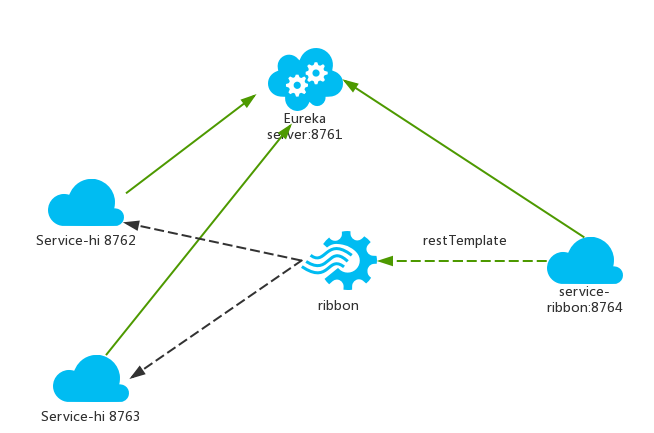

# spring-cloud
 * Understand Spring Cloud and microservices build
 
## -- contents --
 
#### Recommended order：
 
### spring-cloud-pre module
 * The preparation for Spring Cloud
 * 1.For Spring Boot, the configuration file application.properties and application.yml are chosen one by one.
 * 2.In the traditional SpringMVC architecture, we generally put JSP and HTML pages under the webapps directory, 
 but Spring Boot does not have webapps, and there is no web.xml. If we want to write the interface, what should we do?   
 &nbsp;&nbsp; Spring Boot officially provides several template engines: FreeMarker, Velocity, Thymeleaf, Groovy, mustache, JSP.  
 &nbsp;&nbsp; Create two directories under resources: static and templates   
 &nbsp;&nbsp; The static directory is used to store static resources, such as CSS, JS, HTML, etc. 
 The templates directory stores the template engine files. We can create a file under templates: index.ftl 
 (freemarker default suffix is .ftl)
 
### eureka-server module
### eureka-client module
 * Service registration and discovery (Eureka) (Finchley version)
 * Spring cloud provides developers with tools to quickly build distributed systems, 
 including configuration management, service discovery, circuit breakers, routing, micro-proxies, event buses, global locks, 
 decision-making campaigns, distributed sessions, and more. It runs in a simple environment and can run on the developer's computer.
 
### service-ribbon module
 * In the microservices architecture, the business is split into a separate service, and the communication between the 
 service and the service is based on http restful. Spring cloud has two service invocation methods, 
 one is ribbon+restTemplate and the other is feign. This module is based on ribbon+rest.
 * Ribbon is a load balancing client that can control some behaviors of htt and tcp. Feign integrates ribbon by default.
 * The ribbon has implemented these configuration beans by default:
   * IClientConfig ribbonClientConfig: DefaultClientConfigImpl
   * IRule ribbonRule: ZoneAvoidanceRule
   * IPing ribbonPing: NoOpPing
   * ServerList ribbonServerList: ConfigurationBasedServerList
   * ServerListFilter ribbonServerListFilter: ZonePreferenceServerListFilter
   * ILoadBalancer ribbonLoadBalancer: ZoneAwareLoadBalancer  
 * Steps：  
   * Start EurekaServerApplication
   * Start EurekaClient01Application
   * Modify eureka-client's port from 8762 to 8763 in application.yml 
   * Start EurekaClient02Application
   * Start ServiceRibbonApplication
   * Visit http://localhost:8764/hi?name=eureka multiple times on the browser, and the browser alternates:  
     Hi eureka,i am from port:8762  
     Hi eureka,i am from port:8763  
 * Architecture：  
   
  * A service registry, eureka server, port is 8761
  * The service-hi project ran two instances, the ports are 8762, 8763, respectively registered with the service registry
  * The service-ribbon port is 8764, registered with the service registry
  * When sercvice-ribbon calls service-hi's hi interface through restTemplate, because load balancing is performed with 
  ribbon, service-hi:8762 and 8763 two ports' hi interfaces are called in turn.