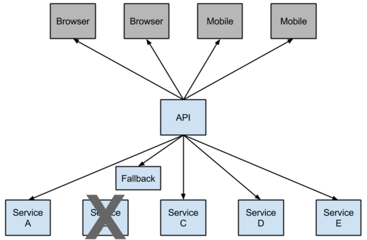

# spring-cloud
 * Understand Spring Cloud and microservices build
 
## -- contents --
 
#### Recommended order：
 
### spring-cloud-pre module
 * The preparation for Spring Cloud
 * 1.For Spring Boot, the configuration file application.properties and application.yml are chosen one by one.
 * 2.In the traditional SpringMVC architecture, we generally put JSP and HTML pages under the webapps directory, 
 but Spring Boot does not have webapps, and there is no web.xml. If we want to write the interface, what should we do?   
 &nbsp;&nbsp; Spring Boot officially provides several template engines: FreeMarker, Velocity, Thymeleaf, Groovy, mustache, JSP.  
 &nbsp;&nbsp; Create two directories under resources: static and templates   
 &nbsp;&nbsp; The static directory is used to store static resources, such as CSS, JS, HTML, etc. 
 The templates directory stores the template engine files. We can create a file under templates: index.ftl 
 (freemarker default suffix is .ftl)
 
### eureka-server module
### eureka-client module
 * Service registration and discovery (Eureka) (Finchley version)
 * Spring cloud provides developers with tools to quickly build distributed systems, 
 including configuration management, service discovery, circuit breakers, routing, micro-proxies, event buses, global locks, 
 decision-making campaigns, distributed sessions, and more. It runs in a simple environment and can run on the developer's computer.
 
### service-ribbon module
 * In the microservices architecture, the business is split into a separate service, and the communication between the 
 service and the service is based on http restful. Spring cloud has two service invocation methods, 
 one is ribbon+restTemplate and the other is feign. This module is based on ribbon+rest.
 * Ribbon is a load balancing client that can control some behaviors of htt and tcp. Feign integrates ribbon by default.
 * The ribbon has implemented these configuration beans by default:
   * IClientConfig ribbonClientConfig: DefaultClientConfigImpl
   * IRule ribbonRule: ZoneAvoidanceRule
   * IPing ribbonPing: NoOpPing
   * ServerList ribbonServerList: ConfigurationBasedServerList
   * ServerListFilter ribbonServerListFilter: ZonePreferenceServerListFilter
   * ILoadBalancer ribbonLoadBalancer: ZoneAwareLoadBalancer  
 * Steps：  
   * Start EurekaServerApplication
   * Start EurekaClient01Application
   * Modify eureka-client's port from 8762 to 8763 in application.yml 
   * Start EurekaClient02Application
   * Start ServiceRibbonApplication
   * Visit http://localhost:8764/hi?name=eureka multiple times on the browser, and the browser alternates:  
     Hi eureka,i am from port:8762  
     Hi eureka,i am from port:8763  
 * Architecture：  
   
  * A service registry, eureka server, port is 8761
  * The service-hi project ran two instances, the ports are 8762, 8763, respectively registered with the service registry
  * The service-ribbon port is 8764, registered with the service registry
  * When service-ribbon calls service-hi's hi interface through restTemplate, because load balancing is performed with 
  ribbon, service-hi:8762 and 8763 two ports' hi interfaces are called in turn.
### service-feign module
  * Feign is a declarative pseudo-Http client that makes writing Http clients easier. With Feign, you only need to 
  create an interface and annotate it. It has pluggable annotation features and can use Feign annotations and JAX-RS 
  annotations. Feign supports pluggable encoders and decoders. Feign integrates Ribbon by default and combines with 
  Eureka to achieve load balancing by default.  
  * in short:  
    * Feign uses interface-based annotations
    * Feign integrates ribbon  
  * Steps：  
    * Start EurekaServerApplication
    * Start EurekaClient01Application
    * Modify eureka-client's port from 8762 to 8763 in application.yml 
    * Start EurekaClient02Application
    * Start ServiceFeignApplication
    * Visit http://localhost:8765/hi?name=eureka multiple times on the browser, and the browser alternates:  
      Hi eureka,i am from port:8762  
      Hi eureka,i am from port:8763 
### Hystrix（断路器）
 * In the micro-service architecture, services are split into services according to the service. The services and services 
 can be called by each other (RPC). In SpringCloud, they can be called with RestTemplate+Ribbon and Feign. To ensure 
 high availability, a single service is usually clustered. For network reasons or for its own reasons, the service is 
 not guaranteed to be 100% available. If there is a problem with a single service, the thread will be blocked when the 
 service is invoked. If a large number of requests flood in, the thread resources of the Servlet container will be consumed, 
 causing service paralysis. The dependency between service and service, the failure will spread, will have catastrophic 
 serious consequences for the entire micro-service system, which is the "avalanche" effect of service failure.  
 In order to solve this problem, the industry has proposed a circuit breaker model.
 * Hystrix: Netflix has created a library called Hystrix that implements the circuit breaker pattern. In a microservice 
 architecture it is common to have multiple layers of service calls.
 * Netflix has open sourced the Hystrix component and implemented the circuit breaker mode, which SpringCloud has integrated. 
 In the microservices architecture, it is very common for a request to call multiple services, as shown below:  
   
 * A lower-level service can cause a cascading failure if it fails. When the call to a particular service is unavailable, 
 a threshold is reached (Hystric is 5 seconds 20 times) and the circuit breaker will be opened. 
   
 * After the open circuit is opened, it can be used to avoid cascading failures. The fallback method can directly return a fixed value. 
 * Steps:
   * Start EurekaServerApplication
   * Start EurekaClient01Application
   * Start ServiceRibbonApplication
   * Start ServiceFeignApplication
   * Visit http://localhost:8764/hi?name=eureka, The web page displays:
     Hi eureka,i am from port:8762
   * Visit http://localhost:8765/hi?name=eureka, The web page displays:
        Hi eureka,i am from port:8762   
   * Stop EurekaClient01Application
   * Visit http://localhost:8764/hi?name=eureka, The web page displays:
     hi, eureka, Sorry, there has occurred an error!
   * Visit http://localhost:8765/hi?name=eureka, The web page displays:
        hi, eureka, Sorry, there has occurred an error! This proves that the circuit breaker is working.  
   * Visit http://localhost:8764/hystrix, The web page displays Hystrix Dashboard.
 